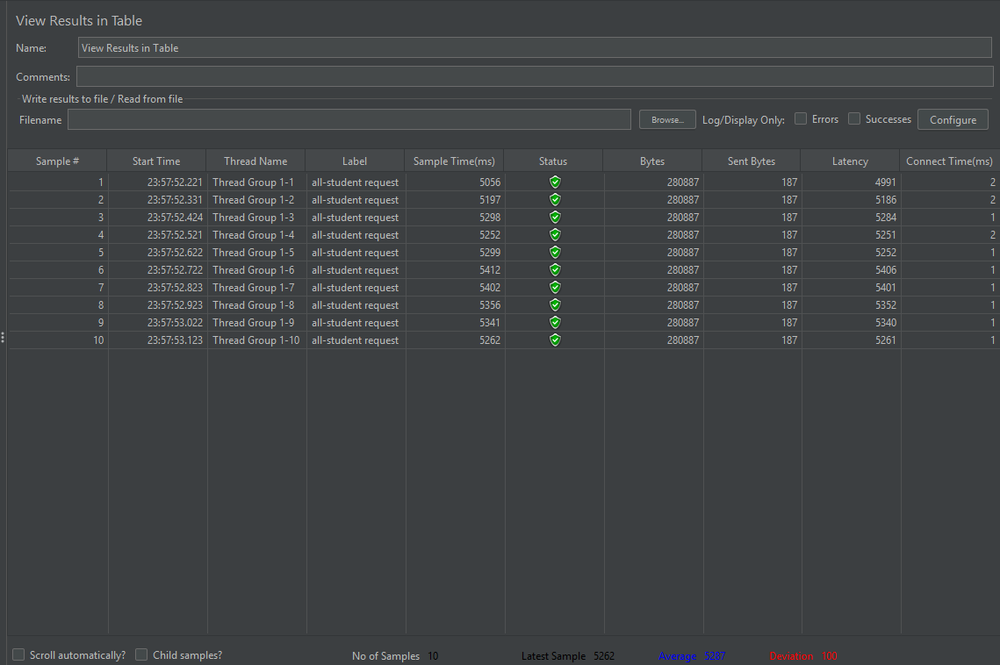
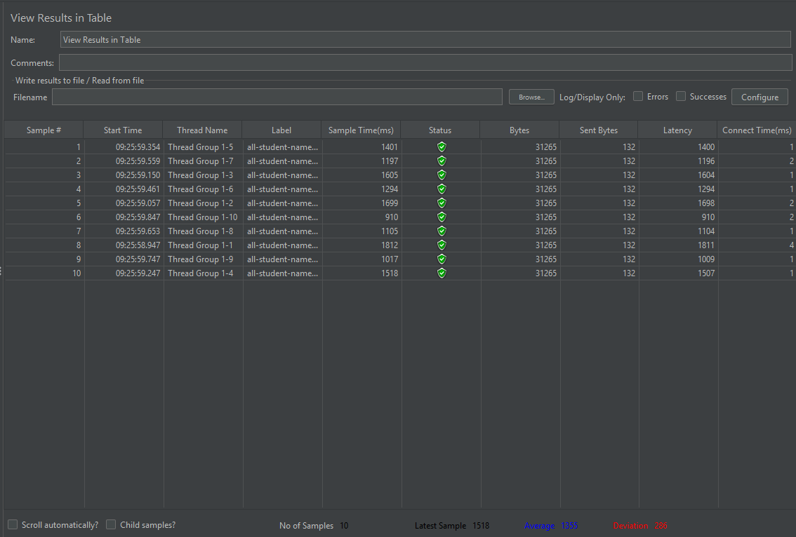
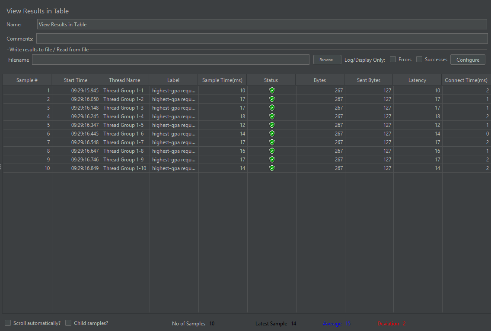
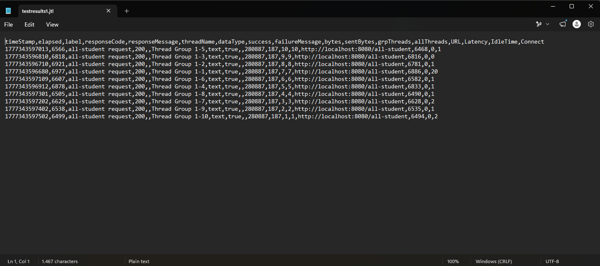
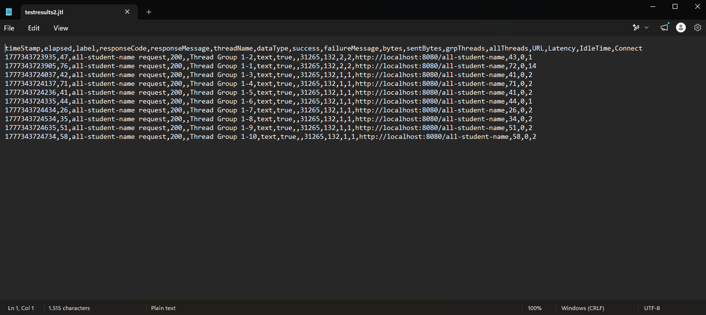
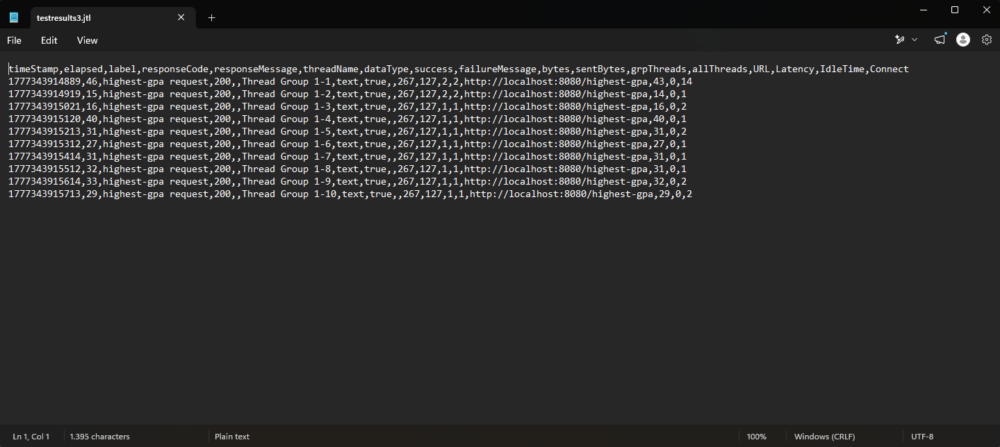

Pada performance test setelah melakukan profiling, sample time pada Thread Group bagian View Results in Table menurun yang artinya waktu yang dibutuhkan server untuk memproses permintaan lebih cepat.

### Refleksi
1. Perbedaan antara JMeter dan IntelliJ Profiler terletak pada fokusnya, di mana JMeter menguji performa aplikasi dari sisi eksternal melalui statistik request dan beban pengguna, sedangkan IntelliJ Profiler menganalisis kesehatan internal kode untuk melihat bagaimana setiap fungsi menggunakan CPU dan memori secara spesifik. 
2. Proses profiling membantu mengidentifikasi titik lemah dengan memvisualisasikan "hotspot" atau area dalam kode yang memakan waktu eksekusi paling lama, sehingga masalah seperti pemanggilan database yang berulang-ulang dapat ditemukan dengan mudah. 
3. IntelliJ Profiler sangat efektif dalam menganalisis bottleneck karena mampu membedakan antara waktu tunggu sistem dan waktu pemrosesan aktif oleh CPU, yang memberikan dasar data akurat untuk melakukan perbaikan kode. 
4. Tantangan utama saat melakukan pengujian adalah memisahkan beban kerja kode buatan sendiri dari beban bawaan framework yang kompleks, namun hal ini dapat diatasi dengan memfilter tampilan profiler agar hanya berfokus pada package proyek yang kita kerjakan. 
5. Manfaat utama yang didapat dari penggunaan IntelliJ Profiler adalah kemampuan untuk melakukan optimasi yang berbasis data, sehingga kita bisa memastikan bahwa perubahan yang dilakukan benar-benar memberikan dampak signifikan pada kecepatan aplikasi. 
6. Jika hasil profiling tidak konsisten dengan temuan JMeter, situasi tersebut ditangani dengan memeriksa faktor di luar kode aplikasi seperti latensi jaringan, performa database server, atau konfigurasi lingkungan tempat aplikasi berjalan. 
7. Strategi yang diterapkan setelah analisis adalah memperbaiki algoritma dan menyederhanakan interaksi database, sementara kepastian bahwa fungsionalitas aplikasi tidak berubah dijamin melalui pengujian unit atau automated testing setelah setiap proses refaktor selesai dilakukan.
